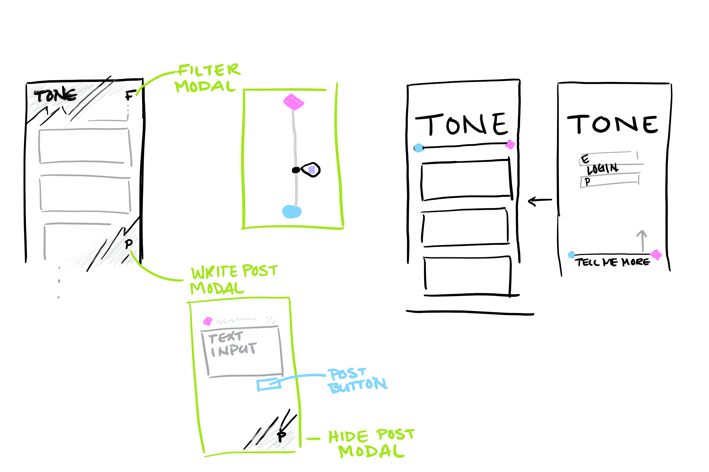

# tone

### Name of project: Tone

### Problem:
    *Sometimes we get a little angry and type things we don't mean. When we are *those thing, we post things we don't want out there. 

### APIs used:
    *Perspective
    *Facebook
    *Twitter (as backup)
    *gmail (as backup)

### New tech used:
    *Angular
    *Foundation
    *Heroku (maybe)

### Sketch of interface:

### Group members:
    *Madison Koch
    *Abe Anderson
    *Esteban Armendariz
    *Holger Mueller

### Description:
    *Tone is an app that determines the toxicity of the text being sent, composed,*or posted. It allows users to check the messages they are about to send from *an unbiased perspective.
